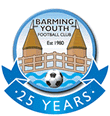

## The first 25 years of BYFC

{:class="img-responsive"}

Starting in September of 1980 with a single side, Barming Youth have blossomed into one of the leading junior football clubs in the Maidstone area, now with two teams in most age-groups up to Under 14s, three girls teams, a nursery and adult side, regular playing tours both within the UK and ambitions to expand. All this has been due to the hard-work, fun and successes of the many players, parents, managers, officials and supporters who have built this Club over the past 25 years and its for these people that we are celebrating our Silver Jubilee today.

The origins of the Club came from boys who played some organised games for Barming Cubs early in 1980. Some Dad's got together to look into the possibility of forming a "real" football league team - this was the brainchild of Alan Welfare, together with support of Dave Williams, Pete Roberts and Dave Coupland.

To set up the Club, each of the boys parents were asked to donate £20, with two in particular, Brian Clifford & Stephen Greig sponsoring the first kits with Stephen Greig becoming the first clubs first President. After making a late application to the Maidstone Primary League, who unfortunately were full (nothing changes), Barming Youth were successful in joining the Medway League, as Under-11s in a tough Under-12 league. And so, in September 1980, the Club was born and played its first competitive match. The squad included: -

Michael Hands, Paul Howard, Michael Howard, Phil Coupland, Keith Morgan (now a golf professional), Nicky Greig, Andrew Clifford, Graham Williams (who designed the Clubs emblem that is still used today), Nigel Roberts, Trevor Roberts, Simon Bourne, Richard Welfare, Nigel Manser, Mark Manser.

Home matches were played at South Street, and the team found the Medway League tough going, in one cold and rainy day changing beneath an upturned boat!

Happily, they were successful in applying to Maidstone Primary League the following season, and the Club have been with the League ever since. The team, squad developed and the Clubs first success was the Under 14s Consolation Cup, as under-13s, to be followed the following year by a narrow defeat in the Challenge Cup, to Nomads 1-0, with 5 of the original squad in the side.. By 1983-1984, the Club had grown into 4 sides, 2 Under-14s, an Under 12, and an Under 10.

Behind the scenes the Club was growing too. Even then, the Club ran a 5-a-side tournament at Belmont Close, penalty competitions and a regular trip to Wembley for a Schoolboy international. Committee meetings were at South Street School, training was at Westborough, Barming Heath, Maidstone Girls Grammar School, on-street running and the summer months were passed by organised cricket matches.

Presentation evenings were always at the Barming Primary School and, in the early days, a certain Peter Taylor, and then, Steve Coppell, presented the awards

Alan Newman became the manager of the Under-10s team and, very unusually, stayed the manager of the each Under-10s team, not "going up" with a team, as they grew older. I can recall Alan coming round to my house to sign my son, Stuart (Ansell), in 1985 and being so positive and enthusiastic about the Club and how it was run. Incidentally, Stuart now starts his 20th season with the Club, and another of the current Seniors squad, Homam Al-Sinawi is starting his 16th. 

### Barming Youth Football Club - September 1987/88

After 1984, as the original side had finished with the Primary League, Alan Welfare formed a new team called Sporting Phoenix but still kept close links with Barming Youth. Phoenix maintained the sides' success and went on to win Under 16 & Under 18 Division 2 titles and a Cup Final.

Back at Barming, in the 1987/1988 season, the Under -12s reached the Consolation Cup final at the Kent Police Ground against Dolphins with a team including the Owen twins, Paul Newman, Michael Fisher, Dom Buschini, Paul Edwards, Danny Burchill.

The Barming Youth Committee then were led by the 2 Johns, Barber and Lamborn, and 1989/1990 was the season when Derek Brown and myself joined the Committee, myself now managing the newly formed Under 11s and Derek as assistant to Alan Newman in the Under-10s. Faces on the Committee then included Pat Fisher (treasurer), Pat Edwards, Dave West, Trevor O'Connor, Trevor Roberts, Peter Pearce, Alan Newman and another new face, Joe Caine.

Shortly after this, came one of the real turning points in Barming Youth's history. The Club persisted with having only one Under 10 squad. This lack of foresight at the time caused a major problem in that, with the phenomenal success of football cascading down to even very young boys, there were over 30 boys wanting to join the Club as Under-10s. The policy then was to have trials and then reject those players not making it. Parents of the heartbroken unsuccessful boys got together to form another Club,
namely Silverdale. Silverdale ran independently for a year and enjoyed a fine season.

During that year, Barming were reeling with the effect that Silverdale were having - they belatedly started a nursery side and there were clear lines being drawn between Barming Youth and Silverdale. Relations were either non-existent or frosty to say the least (remember we're talking about Under-10s football).

It was Silverdale's "can-do" attitude from guys like Tamar Djevat, Les Thorneycroft, Nigel Fillingham, Phil Taylor, Jim Beckett & Chris Hubbard who shook the Barming Youth Committee from their easy existence. By this time, Joe Caine and Steve Ansell had become Chairman and Secretary of Barming Youth - they were to spend many hours discussing the best way forward and how to bring the rest of the Committee with them, for, at the time, there were many on the Barming Youth side were not even prepared to talk about Silverdale.

Common sense eventually prevailed, even though discussions were difficult (I can recall 1 particularly bad evening in Chris Hubbards house) and the following season Silverdale were part of Barming Youth, although for a time retaining their name. 

### Barming Youth Football Club - September 1990/91

This episode had the effect of pushing Barming Youth to expand, they now had Under-9 teams like every other Club. Apart from Silverdale there were one or two other outstanding teams, one run by Trevor Roberts (from the original squad) - in that side was Paul Booth who went to play for Gravesend, Steve Chamberlain, Richard Bowden-Brown ( son of Maidstone Uniteds chairman) and one by Trevor O'Connor , who in 1990-1991 joined the Maidstone & Mid-Kent Sunday League , and won Division 5 at the first attempt. Trevor was not only to become Chairman after Joe Caine, he was voted Linesman of the Year twice by the League and appointed as a Life member of the Club.

In 1991, Barming Youth started the first of its annual 6-a-side tournament, with a format that is still used today. It was held at the School in the worst weather imaginable - and we thought that Mr Whitwood would never let us play there again - and one of the age-groups were won by Silverdale

Around that time the Club also donated £200 to Maidstone Hospital Baby Unit. Further, we also developed a Club magazine, Barming Blues, which ran for two seasons - a fore-runner to the Web-site and every year there was a trip to a Premiership match in London.

The Club was now fully expanded by the mid-1990's with virtually a team at every age-group up to Under-18s, and 2 senior sides. Trophies started to come our way as more boys started to want to join. My side started to get more ambitious and as Under-14s, we stared our first "tour" - a weekend in Wales - a couple of matches plus a trip to Cardiff v Barnet and staying on the floor in a freezing Church Hall in the bleak Welsh countryside. Included in my side then was Richard Sinden, who was to go onto to play for Wimbledon Youth , Dundalk and several Kent leagues sides including Maidstone. This was to be followed by 2 more Wales trips and we've now been on 5 European trips to Antwerp, Amsterdam, Cologne, Munich and Lloret. Other teams are now following suit and there a regular trips now to Butlins and last year to Spain. All just for the football of course!!!

There have been a couple of odd-ball moments - the rigged Christmas raffle ( won't go any further) , the less than straight Treasurer (won't go any further either).

In the past couple of years there have been two truly outstanding sides developed, one won back-to-back League and Cup doubles in the early 2000s (Mick Dray and Paul Flisher's side that included Robbie Hannon, Harry Haswell, Tom Parkinson, Sam Ringwood, Alex Flisher, Jack Cooper and Josh Stanford) and the current Under 10s who have also had great success (Jocky's team that includes Dan Parkinson, Joseph Crampton, Callum Hoare, William Taylor, Troy Smith, Sam Prideaux, Ciaran Jones and Jack Cooper). Although we all love success, there has been just as much congratulations for the sides who manage to win the odd game in a season (I've been there!!)

Of course, I won't be able to name all the committee members, officials and players that have gone through the Club over the past 25 years - we've had Chairman from Dave Coupland, Pete Roberts, John Barber, Joe Caine, Trevor O'Connor, Steve Ansell, Derek Brown to Dave Jacobs. Secretaries from Dave Williams, John Lamborn, Steve Ansell, Chris Hubbard, Dave Luckhurst , Donna Flisher to Denise Wright. Treasurers from Margaret Williams, Pat Fisher, Angus MacCrae, Chris Hubbard, Steve Jeal, Kevin Roberts, Gareth Jones to Bev Burgum (apologies if I've missed someone! )and numerous great Committee members , parents and supporters all wanting to do the best for the Club, but above all it has been the loyal players who have built this Barming Youth to where it is today.

Thanks to Steve Ansell, ex-Chairman, ex-Secretary, Manager of the Senior side and longest serving committee member, for submitting all of the history of the club's past 25 years. 
